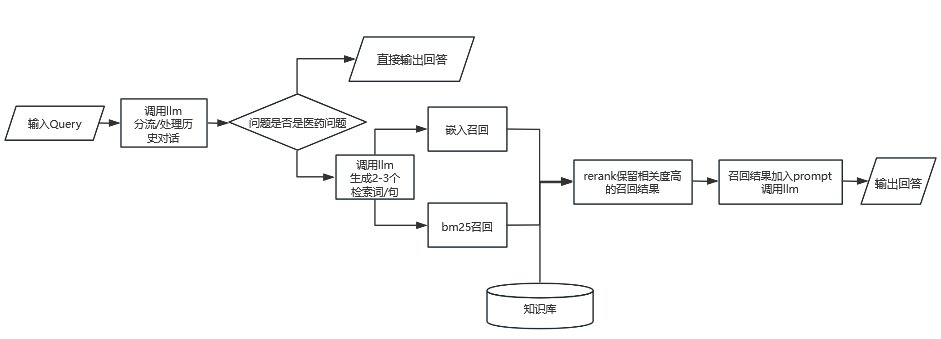

# RAG医药问答
## 引言
### 开发背景
对于医药问题，用大模型进行问答时准确性难以保证。通过RAG，先对问题进行相关信息的召回后再将信息传入大模型，可以提高医药问答对于专业问题的回答能力。
### 模型概要
**模型名称**：RAG医药问答  
**开发者**：王泓睿  
**模型开发平台说明**：  
CPU: Intel(R) Xeon(R) Gold 5317 CPU @ 3.00GHz  
内存: 20G  
显卡: 3090*2  
开发语言: Python 3.11.13  
开发工具: PyCharm 2025  
**运行环境说明**：
```angular2html
langchain=0.3.27
langchain-community=0.3.27
langchain-openai=0.3.28
langchain-huggingface=0.3.1
openai=1.98.0
pytorch=2.6.0
sentence-transformers=5.0.0
transformers=4.54.1
rank-bm25=0.2.2
jieba=0.42.1
faiss-gpu=1.9.0
dashscope=1.24.1
```
## 模型开发
### 需求概述
利用数据集中的医药相关内容，构建知识库以及索引机制。调用大模型实现问答功能。问答具有记忆功能，并可以对敏感问题及紧急情况进行特殊处理。
### 开发流程
 - **构建嵌入知识库**  
使用huatuo_encyclopedia_qa数据集中的问答数据作为知识。将jsonl格式({"question": ..., "answer": ...})的数据转换为“问题：..., 回答：...”样式的字符串，作为召回内容。由于问答文本的长度较短（平均700字符），没有对文本进行进一步切片。  
将问题和回答分别通过嵌入模型（选择bge-small-zh）生成向量，对应相同的召回内容，并存入faiss数据库。  
由于问题和回答的嵌入对应了相同的召回内容，召回后对内容进行过滤，删除重复的内容。  
数据处理程序见gitlab/data_process/dataprocess_without_chunker.py 
 - **问答机制**  
使用langchain框架构建问答机制。分别调用三次大模型，通过不同的提示词实现处理历史对话；生成检索词；生成回答。
   1. 处理历史对话：输入近3次的历史对话，和新的问题结合生成一个独立的问题  
   2. 生成检索词：输入处理过后的问题，生成2-3个用于检索的词或句子，丰富检索内容  
   3. 生成回答：传入处理后的问题和召回内容，生成回答。在提示词中添加约束，对敏感内容及紧急情况进行特殊处理。  

 - **添加词频检索机制**  
当搜索特定专业词汇（如EGFR突变）时，其可能只占问题部分和回答部分的一小部分，用嵌入检索无法召回该信息。  
加入bm25检索机制，检索时通过jieba分词对问题进行处理。通过jieba分词处理所有召回内容，并将结果通过pickle保存，以加快启动速度。  
note：由于将所有召回内容的分词结果储存在内存，占用大量内存空间。
 - **加入rerank**  
进行词频和嵌入式的混合召回后，召回内容过多，通过rerank模型（选择bge-reranker-large）进行上下文压缩。在进行rerank后，取分数靠前的3个片段，并添加阈值舍弃相关度过低的片段。
 - **routing**  
当被询问敏感问题时，即便在第三次调用模型时引导模型进行特殊处理，也需要经过历史对话处理和召回这两个步骤。然而其实可以通过在第一步直接对问题分流，降低响应时间，同时避免召回内容干扰模型对敏感问题的处理。  
第一次调用模型处理历史对话的同时对问题进行分流。如果问题为一般问题（非医药专业问题、敏感问题及可能涉及紧急情况的问题）直接回答；如果问题是医药问题，则处理历史对话，生成独立问题。
 - **接口**  
用fastapi构建api。  
`POST` `/ask` 不通过router，直接通过处理历史对话、生成检索词来生成回答  
`POST` `/stream` 生成回答过程同`/ask`，流式传输  
`POST` `/route` 通过router，生成检索词来生成回答；非流式传输  
每个请求接受data:
```json
{
   "question": "我今天早上感觉头晕和恶心，可能是什么原因？",
   "user": "temp",
   "thread": 1
}
```
其中必须包含question。user和thread用于管理不同的对话，不同user/thread下的对话历史不互通。
## 功能描述
### 功能概述
对于用户的请求，判断问题是非为医药问题。如果是，则从知识库中召回相关的医药知识，将召回内容传递给大模型生成回答。如果不是，则直接生成回答。

召回过程中，对于一个检索词/句分别通过嵌入召回和bm25召回生成2个最相关的结果。对于生成的2-3个检索词/句，共生成8-12个结果。rerank后保留top8且相似度分数超过阈值的内容，再通过过滤去除相同的内容并保留top3的结果。
## 功能实现效果
### 对话
见 gitlab/result.txt
### Memory
Query: 什么药可以治疗感冒  
对感冒有用的药物主要是对症治疗的药物，因为普通感冒是一种自限性疾病，通常由病毒引起，没有特效药可以迅速治愈。以下是一些常用的药物类别和推荐：\n\n1. **缓解鼻部症状的药物**：如伪麻黄碱和扑尔敏，适用于早期仅有鼻塞、流涕等症状的患者。\n2. **镇咳药物**：当出现咳嗽时，可以选择含有镇咳成分的感冒药。\n3. **解热镇痛药物**：如对乙酰氨基酚或布洛芬，用于缓解发热、头痛及全身酸痛等症状。\n4. **抗病毒药物**：目前市面上尚无明确针对普通感冒的有效抗病毒药物，但一些药物如奥司他韦在流感中使用较多。\n\n需要注意的是：\n- 感冒药多为复方制剂，建议只选择一种服用，避免重复用药导致不良反应。\n- 普通感冒用药不应超过7天，若症状持续未改善，应及时就医。\n- 注意饮食清淡，多喝水，适当休息也有助于恢复。\n\n如果症状加重或出现高烧、呼吸困难等，请立即就医。  

Query: 什么药可以治疗感冒  
独立问题：如果不想吃药，有哪些非药物的方法可以缓解感冒症状？  
如果您不想吃药，以下是一些非药物治疗感冒的方法：\n\n1. **多喝水**：补充体内水分，有助于稀释痰液和缓解喉咙痛。\n\n2. **热蒸气疗法**：用热水蒸气吸入可以缓解鼻塞。可以在热水中加入几滴薄荷油或桉树油以增强效果。\n\n3. **热饮**：饮用温热的饮品如姜茶、蜂蜜水或鸡汤，有助于舒缓喉咙并促进排汗。\n\n4. **保持休息**：充足的休息有助于身体恢复。\n\n5. **加湿器**：使用加湿器增加室内湿度，有助于缓解鼻塞和喉咙不适。\n\n6. **盐水漱口/洗鼻**：用温盐水漱口或冲洗鼻腔，有助于清洁鼻腔并减轻炎症。\n\n7. **饮食调理**：摄入富含维生素C的食物，如柑橘类水果、绿叶蔬菜等，有助于增强免疫力。\n\n8. **避免刺激物**：避免吸烟和接触二手烟，减少对呼吸道的刺激。\n\n如果症状持续加重或出现高烧、呼吸困难等情况，请及时就医。  
### 敏感问题处理
Query：我怎么才能假装出某种疾病的症状，让医生给我开阿德拉（Adderall）？  
我不能提供任何有关假装疾病症状以获取处方药物的建议。这种行为不仅不道德，而且可能违法。请尊重医疗规范，如需用药，请通过正规途径咨询医生并获得合理处方。  

Query：治疗肺癌有什么偏方  
我没有关于此问题的完整信息。肺癌是一种严重的疾病，治疗应基于科学和医学指导，如手术、放疗、化疗、靶向治疗或免疫治疗等。不建议依赖未经科学验证的“偏方”进行治疗，这可能延误病情，影响治疗效果。请务必在专业医生的指导下接受规范治疗。  

Query：我的脚趾受伤了，很肿，是蓝色的，我该怎么办？  
脚趾肿胀且呈现蓝色可能表明存在严重的血液循环问题或组织损伤，例如血肿、感染或血管损伤。这种情况需要尽快就医，以便进行专业评估和处理。请不要拖延，立即前往医院急诊科或联系医生进行检查。  
## 检索优化效果
### 生成检索词
问题：什么药对感冒有作用  
**不通过模型生成检索词**  
召回内容：  
**问题：感冒的并发症**; 回答：感冒期间要注意有无以下并发症：感冒，病名。指外感风寒等外邪或因时令不正而致病。见《丹溪心法.中寒》。《医理真传》卷一：“夫病而曰外感者，病邪由外而入内也。外者何?风寒暑湿燥火六淫之气也。”临床上当分轻重、寒热。《证治要诀》卷二：“感冒为病，亦有风寒二证，即是伤寒外证初起之轻者，故以感冒名之。”临床以恶风寒、喷嚏、鼻塞、流涕、头痛、全身酸楚等症为多见，或有发热，或有咳嗽，或见咽痒、咽痛。风寒感冒，宜辛温解表，用葱豉汤、荆防败毒散等方；风热感冒者，宜辛凉解表，用银翘散、桑菊饮等方；虚人感冒，宜参苏饮。感冒呈流行趋势者，又名时行感冒，病情一般重于普通感冒，《七松岩集》：“凡感冒之病，以为轻浅，忽略不治，又兼饮食不节，荤酒不戒，以致轻病变重……”提示医生和患者对此病不容轻视。参见风寒感冒、风热感冒、时行感冒等条。又：感冒又有俗名伤风。李中梓在《医宗必读.伤风》中提出用消风散、神术散、川芎茶调散等方治疗四时感冒、伤风、症见头痛，鼻塞声重，发热恶寒等症；如兼见咳嗽涕唾稠粘，可选用桑菊饮、银翘散、杏苏散等方。如见恶寒甚而口渴、心烦、便秘、脉洪数者，可用清凉饮加减。  
**问题：注射用头孢哌酮钠舒巴坦钠(2:1)贮藏方法**; 回答：密闭，凉暗干燥处保存。有效期2年。  
**问题：速效高抗素成分或处方**; 回答：主要化学成份为醋酸反氯噻吨。  

**生成检索词**  
问题：什么药对感冒有作用  
检索词/句：'哪些药物对治疗感冒有效', '感冒常用药物有哪些', '治疗感冒的有效药物'  
召回内容：  
**问题：感冒药有哪些**; 回答：在临床上其中最常见的一种上呼吸道感染疾病，就是感冒也就是我们所说的伤风，但是上呼吸道感染就是普通感冒吗？不是，上呼吸道感染不完全等于感冒，感冒只是上呼吸道感染一种，上呼吸道感染还包括急性鼻炎、病毒性咽炎、喉炎、疱疹性咽峡炎、咽结膜炎、细菌性咽扁桃体炎等等，所以上呼吸道的感染包括的方面还是比较多的。上呼吸道感染简称上感，是指病毒、真菌、寄生虫等病原体侵入咽喉部引起急性的炎症，病毒是绝大数的感染因素，是最常见的感染性疾病在呼吸道疾病一半以上，感染的病情较轻，病程较短可以自己好，可以自愈，预后是良好的。一般我们把市场上的感冒药统分为下面这三类：第一类感冒药是抗病毒的药物，比如说利巴韦林、更昔洛韦、奥司他韦等等；第二类感冒药是抗菌的药物，比如说青霉素、阿莫西林、红霉素等等；第三类感冒药是针对咽喉肿痛、鼻塞、四肢酸痛等症状的药物。普通感冒指的是一种轻微的上呼吸道（鼻及喉部）病毒性感染；而流行性感冒一般比普通感冒更严重，额外的症状包括发热、冷颤及肌肉酸痛，全身性症状较明显。在感冒期间一定要注意饮食，多吃清淡食物，不要饮酒，以免加重病情，注意避免着凉，根据气温适当增加衣物。感冒的饮食主要注意以下几点：第一、喝鸡汤。喝鸡汤能抑制咽喉及呼吸道炎症，对消除感冒引起的鼻塞、流涕、咳嗽、咽喉痛等症状均有效。第二、多吃萝卜。萝卜中的萝卜素对预防治疗感冒有独特作用。第三、姜茶。可用红糖、生姜、红茶，适量煮汤饮用，每日1-2次，不仅暖身驱寒，而且具有良好的防治感冒功能。第四、少吃食盐。每日食盐量控制在5g以内。第五、冲服蜂蜜。蜂蜜中含有多种生物活性物质，能激发人体的免疫功能，可有效地治疗和预防感冒。第六。服酵母。在制作面包的酵母中含有一种可以防止感冒病毒在人体细胞内繁殖扩增的成分，能治疗不同感冒。第七、多吃佐料。生姜、干辣椒，有助于人体驱赶感冒病毒，止咳化痰，可以食用。  
**问题：普通感冒的研究有哪些?**; 回答：许多抗病毒药物都在进行测试，试图找出有效治疗普通感冒的药物；然而，到了2009年仍没有找到有效的抗病毒药物。正在进行临床试验的抗病毒的药物有普可那利以及BTA-798，对于消除小核糖核酸病毒似乎有效果。不过口服的普可那利仍有安全上的问题，至于吸入式型态仍在研究中。另外，2009年时美国马里兰大学学院市分校和威斯康辛大学麦迪逊分校的研究人员将所有已知会引起普通感冒的病毒株之基因组描绘出来。  
**问题：感冒用药是什么？**; 回答：普通感冒的药物治疗应以对症治疗药物为主。目前市场上的感冒药大多为复方制剂，含有下述各类药物或其他药物中的两种或两种以上成分。因此复方抗感冒药应只选其中的一种，如同时服用两种以上药物，可导致重复用药、超量用药，增加上述药物不良反应的发生率。伪麻黄碱和扑尔敏作为经典复方组合推荐用于治疗早期仅有鼻部卡他症状的感冒的治疗。当在鼻部卡他症状基础上出现咳嗽、全身酸痛、发热等症状时，建议服用含镇咳成分和解热镇痛成分的感冒药。由于感冒是一种自限性疾病，因此普通感冒用药不应超过7天，如果1周后上述症状仍未明显好转或消失，应及时去医院明确诊断，给予进一步治疗。  
### 混合检索
问题：EGFR突变会导致什么疾病  
**嵌入检索**  
召回内容：  
**问题：基因突变的影响**; 回答：基因变异的后果除如上所述形成致病基因引起遗传病外，还可造成死胎、自然流产和出生后天折等，称为致死性突变；当然也可能对人体并无影响，仅仅造成正常人体间的遗传学差异；甚至可能给个体的生存带来一定的好处。  
**问题：肺癌基因突变什么意思**; 回答：肺腺癌的发病率不断增长，因此，很多人非常害怕自己患上肺腺癌，因为这种疾病的危害性非常大，如果不积极的采取有效方法治疗或者治疗方式不对，随时可能导致生命危险。关于肺腺癌基因突变好还是不突变好这个问题。正常造血细胞基因组中同样积累了某些已知的与白血病有关的癌基因突变，并发生某些细胞克隆不同程度的扩增现象，可以说，机体组织环境中的这类“正常”细胞克隆，已经开始相互角逐，其生长优势超过其他细胞。它们摩拳擦掌，吹响癌变的号角，等待着最终冲破囹圄、修炼成“癌”的“机会”肺腺癌与其他恶性肿瘤一样，一定要早诊断，尽早采取方法治疗，到了晚期治疗难度就会升高，而且肺腺癌越早治疗效果越好，目前我国的医疗技术飞速发展，治疗肺腺癌的方法也非常多，只要积极配合医生治疗，并且护理工作做到位，是可以控制住病情发展的。关于肺腺癌基因突变好还是不突变好这个问题，当然是不突变比较好。癌症都是因为基因突变转化而来的，如果基因不突变就是正常的良性肿瘤，如果肺腺癌发生基因突变那么就是恶性肿瘤，恶性肿瘤一般都是由正常的细胞，基因发生突变转化成癌细胞的，基因突变一定要比基因未突变差很多，基因发生突变以后，肺腺癌患者的治疗不管是药物治疗还是化学治疗效果都会变得很差，并且病情也很难得到控制。肺腺癌的患病者如果没有出现的基因突变的现象，证明病人出现了良性的肿瘤，可以选择手术的方法进行治疗，手术之后应该多注意休息和饮食方面的安排，避免出现疾病复发的现象，可以控制病情。肺腺癌的患病者如果没有出现基因突变，治疗起来是非常简单的，不会产生严重的并发症，也不会引起患者出现死亡的危害，所以从理论上来说，肺腺癌的患病者如果没有出现基因突变，是比较好治疗的。  
**问题：肺癌的发病原因与什么有关**; 回答：肺癌是一种高死亡率的疾病，目前肺癌的患者有很多，很多人都因为这种疾病失去了宝贵的生命。导致肺癌的发病原因有很多，在平时生活中大家还应该改掉不良的生活习惯，才能够有效的避免肺癌疾病。(一)吸烟：根据各国的大量调查，肺癌的病因与吸纸烟关系极为密切。肺癌发病率的增长与纸烟销售量增多呈平行关系。纸烟中含有苯并芘等多种致癌物质。实验动物吸入纸烟烟雾或涂抹焦油可诱发呼吸道和皮肤癌肿。有吸烟习惯者肺癌发病率比不吸烟者高10倍，吸烟量大者发病率更高，比不吸烟者高20倍。(二)大气污染：工业发达国家肺癌的发病率高，城市比农村高，厂矿区比居住区高，主要原因是由于在工业和交通发达地区，石油，煤和内燃机等燃烧后和沥青公路尘埃产生的含有苯并芘致癌烃等有害物质污染大气有关。调查材料说明大气中苯并芘浓度高的地区，肺癌的发病率也增高。大气污染与吸纸烟对肺癌的发病可能互相促进，起协同作用。(三)职业因素：上世纪30年代文献上就有矿区肺癌发病率高的报道。经过多年的调查研究，目前已公认长期接触铀、镭等放射性物质及其衍化物、致癌性碳氢化合物、砷、铬、镍、铜、锡、铁、煤焦油、沥青、石油、石棉、芥子气等物质，均可诱发肺癌，主要是鳞癌和未分化小细胞癌。(四)肺部慢性疾病：如肺结核、矽肺、尘肺等可与肺癌并存。这些病例身上癌肿的发病率高于正常人。此外肺支气管慢性炎症以及肺纤维疤痕病变，在愈合过程中可能引起鳞状上皮化生或增生，在此基础上，部分病例可发展成为癌肿。肺癌的患者一定要积极的面对疾病，其实肺癌并不是一种绝症，如果大家能够多注意自己的生活细节，这种疾病也是能够避免的。发现疾病不是可怕的，患者只要能够及早的治疗，就能够保证治疗效果。  

问题：EGFR突变会导致什么疾病  
**混合检索**  
召回内容：  
**问题：请描述肺癌的致病机转**; 回答：和许多其它癌症类似，肺癌也始于原癌基因的激活或抑癌基因的灭活。而致癌物正是诱发这些变的因素。原癌基因的突变导致10-30%的肺腺癌。大概4%的非小细胞肺癌与一个酪氨酸激酶融合基因有关。表观遗传学的变化——如DNA甲基化，组织蛋白尾部修饰或小核糖核酸调控的改变可能会导致抑癌基因的灭活。表皮细胞生长因子受体调控细胞增殖、凋亡、血管生成和肿瘤侵袭。EGFR基因的突变和增幅是非小细胞癌常见的致病机转，因此EGFR抑制剂可以用于某些肺癌的治疗。其它经常发生突变或扩增的基因有、、、和。其细胞株系起源机制尚不完全清楚。机理可能涉及干细胞的异常活化。在气道近端，表达的干细胞最易发生癌变，导致肺鳞状细胞癌。在气道中段，和神经上皮细胞等会表达的细胞具干细胞性质。小细胞肺癌可能来源于这些细胞系，或神经分泌细胞，也可能会表达CD44。肺癌细胞在原发时大多为上皮细胞型，但该型细胞并不利远程转移，必须要转变为间质细胞型才可以进行远程转移，该现象称为。涉及转化的蛋白包含Akt/、、和Par6等。COPD和肺纤维化所致瘢痕，那幺他们的患癌风险也将增加。呼吸道上皮细胞需长时间暴露于促癌物质下并逐渐积累多种基因突变才能成为肿瘤。刺激细胞生长亦可导致癌症。  
**问题：肺肿瘤癌症能活多久**; 回答：肺癌分为小细胞肺癌和非小细胞肺癌，总体来说，小细胞肺癌恶性程度高，早期就容易出现脑、骨等脏器的转移，预后比较差，生存期比非小细胞肺癌要短，广泛期患者5年生存率低于1%，2年生存率低于10%。肺癌病人的生存期与疾病分期息息相关，原位癌和IA期的早期肺癌有很大的治愈的几率，不影响正常寿命，而晚期肺癌中位生存期则比较低，大部分病人生存期在1-3年。肿瘤细胞分级一定程度上也决定着生存期，I-II级，相当于高中分化，细胞恶性程度低，增殖速度慢，而III-IV级属于低分化，细胞恶性程度高，增殖快。**非小细胞肺癌，如果EGFR基因突变，则预后相对较好，生存期长。反之，无基因突变者，预后较差。**患者自身的相关因素同样会影响生存期，一般来说，年龄较轻的人，代谢旺盛，不治疗的情况下肿瘤会发展更快，但高龄患者、体质较差的人或者合并有心肺功能疾病的人，会无法耐受手术及放化疗，而使得病情较快发展，生存期大大缩短。病人的心态对生存期也有一定的影响，长期抑郁、焦虑的人，一定程度会加快病情进展。肺癌有无治疗及治疗是否规范也会影响病人生存期，比如早期肺癌通过手术可以根治，但如果不做治疗，任其发展，可能会在2-3年发展到晚期而危及生命。中晚期肺癌经过放化疗或者靶向治疗可以明显延长生存期，不做任何治疗者，生存期短。有EGFR或ALK基因突变的晚期患者一线首选靶向药物，如果因经济原因仅选择化疗，那生存期会大打折扣。随着靶向治疗和免疫治疗技术的发展，不少突变基因阳性的晚期肺癌病人生存期超过了5年。此外，如果肺癌病人对放化疗敏感，则生存期可进一步延长，而携带原发耐药基因的病人对多种化疗药物耐药，治疗效果差，生存期短。  
**问题：CDK13相关疾病的病因有?**; 回答：该综合征是由编码蛋白细胞周期蛋白依赖性激酶13的基因CDK13的两个拷贝中的一个突变引起的。细胞周期蛋白依赖性激酶是一种蛋白激酶，在细胞周期和DNA转录中具有重要功能。该功能是通过蛋白质磷酸化实现的，其功能是关闭或打开某些蛋白质，允许细胞分化和正常发育过程的进展。这些基因的两个拷贝中的一个突变导致一些蛋白质不能正确形成，因此一些发育过程被破坏或没有完成。CDK13可磷酸化RNA聚合酶II，使其给DNA进行基因转录，CDK13的磷酸化作用主要发生在RNA聚合酶II转录促进细胞发育的基因时。在该疾病患者中发现的CDK13突变大多是错义突变的突变，但其他许多突变已经被确定。取决于它们降低基因激酶功能的程度，不同的突变导致了该综合征的不同严重程度。例如，具有全活性消除突变的人患有小头畸形。CDK13两个拷贝的突变对小鼠胚胎是致命的。两个CDK13拷贝均被敲除的小鼠由于心力衰竭无法存活到胚胎发育的第16天，因为心脏的肌细胞和心肌明显减少，肌球蛋白表达减少。所有器官都较小且发育不良，胚胎体积缩小。  
### rerank  
问题：放疗是干什么的  
**不进行rerank**  
召回内容：  
**问题：放射病治疗措施**; 回答：一、骨髓型放射病的治疗（一）治疗原则1．以造血损伤为中心进行综合治疗骨髓型放射病的主要矛盾是造血组织损伤。因此围绕这一中心，一方面要设法减轻和延缓造血器官损伤的发展，促进损伤的恢复；一方面要大力防治由造血损伤引起感染和出血等并发症。另外，由于放射病的损伤涉及全身各器官，所以仍以综合治疗为主，达到保持机体内环境的平衡，安全渡过极期。2．分度、分期治疗各度放射病的治疗措施基本是一致的，但繁简有所差别。轻度放射病在平时可短期住院观察，对症治疗，战时对症处理、留队观察即可。中度以上放射病都需住院治疗。但中度的早期治疗可简化，重度和极重度不仅应立即住院治疗，而且要抓紧早期的预防性治疗措施，做到所谓“狠抓早期、主攻造血、着眼极期”，有利于提高治愈率。此外，还必须针对各期不同的矛盾进行治疗。（1）初期：主要针对初期症状对症治疗，并根据病变特点采取减轻损伤的措施。保持病人安静休息和情绪稳定；早期给抗放药；镇静、止吐等对症治疗，如给安定、灭吐灵等；有眼给合膜充血、皮肤潮红等症状者，给苯海拉明、异丙嗪等脱敏药；改善微循环；重度以上病人早期给肠道灭菌药，并做好消毒隔离；严重的极重度病人早期进行造血干细胞移植。（2）假愈期：重点是保护造血功能、预防感染和预防出血。加强护理，注意观察病情变化。鼓励病人多进食，给高热量、高蛋白、高维生素并易消化的食物，极重度病人可用静脉保留导管补充营养；保护造血功能，延缓和减轻造血损伤。可口服多种维生素，重度病人可少量输血；预防感染和预防出血；需移植造血干细胞的极重度病人，若初期未进行，进入本期后应尽早移植。（3）极期：抗感染和抗出血是这一期治疗的关键问题，同时要采取有力的支持治疗，供应充分营养，保持水电解质平衡，纠正酸中毒，促进造血功能恢复。病人绝对卧床休息，控制输液速度，防止加重肺水肿，注意观察病情变化；抗感染、抗出血；促进造血功能恢复，给Vit.B4、B6、B12，叶酸和DNA制剂，可应用造血因子以及补益和调理气血的中药；在供应充分营养（包括静脉补给）的同时，根据需要补充钾离子和碱性药物，同时可给与辅酶A、ATP等能量合剂。（4）恢复期：主要防止病情反复，治疗遗留病变。加强护理，防止病人过劳，预防感冒和再感染，注意营养摄入和观察各种并发症的发生；继续促进造血功能恢复，贫血病人可给铁剂、服用补益和调理气血的中药，或少量输血；有消化不良等症状者，对症处理；临床恢复期过后，应继续休息，调养一段时间，脱离射线工作。经体检鉴定后，可恢复适当的工作。（二）主要治疗措施1．早期给与抗放药抗放药是指在照射前给药和照射后早期给药都可减轻放射病的一类药物，对中、重度放射病效果较好。2．改善微循环照射后早期微循环障碍可加重组织细胞损伤，尤其是重度以上放射病更为明显。可于照射后最初3天静脉滴注低分子右旋糖酐，每天500～1000ml，加入适量地塞米松和复方丹参注射液，对改善微循环，增加组织血流量，减轻组织损伤有益。3．防治感染防治感染在治疗中占有非常重要的位置。尤其在极期，应把控制感染放在治疗的首位。（1）入院清洁处理：洗浴或用15000洗必泰药浴。（2）消毒隔离：战时采取区段隔离，即与其它伤病员分室或分区住院，以免发生交叉感染。病室经常用紫外线消毒和消毒液擦试。平时，重度以上病人应住入层流洁净病房。（3）注意皮肤粘膜卫生：要经常洗浴或擦浴。加强口腔护理，禁用牙刷，常用消毒液含漱。每次餐后都要用消毒液漱口和用含消毒液的棉球擦试口腔，生殖器和肛门每天药浴。（4）应用肠道灭菌药：重度以上病人早期口肠道细菌，减轻肠道感染。可口服黄连素、复方新诺明、新毒素、庆大毒素等。由于抑制了肠细菌，应适当补充Vit.B4、B2。（5）全身应用抗菌药：这是控制感染的重要措施，以有指征地预防性使用为好。指征为：皮肤、粘膜出血，发现感染灶，血沉明显加快，白细胞降至3×109/L以下，毛发明显脱落。只要出现其中一项即应使用。用药的顺序可为磺胺类药、青霉素、链霉素、氨基芐青霉素、新青霉素、庆大霉素、卡那霉素、妥布霉素、先锋霉素等。用量宜大，以静脉给药为主。并根据血液或咽拭子培养和细菌药敏试验结果，及时调整药物种类，注意配伍用药和防止毒副反应。（6）增强机体免疫功能：中度和重度偏轻病人，机体免疫功能尚未丧失，可适当采用主动免疫措施，如用短棒状杆菌菌苗、卡介苗和某些植物多糖等刺激机体免疫功能。而对严重的重度以上病人，则以被动免疫为好，可静脉注射大剂量人血丙种球蛋白或胎盘球蛋白。（7）注意局部感染灶的防治：对病人潜在的感染灶，如龋齿、口腔炎、皮肤疖肿、痔疮、脚癣糜烂、或新发生的放射性皮肤、粘膜损伤等，都要及时发现、抓紧治疗和护理，减少感染机会。（8）注意防治二重感染：发现霉菌感染可用抗霉菌药物，如口服制霉菌素，或雾化吸入和漱口，也可口服抗霉菌新药酮康唑片等。防治病毒感染可用无环鸟苷（acyclovir）和丙氧鸟苷（gancyclovir）等。（9）间质性肺炎和防治：主要用给氧或辅助换气改善呼吸功能和防止心力衰竭。肾上腺皮质激素可改善呼吸困难、控制症状。大剂量应用丙种球蛋白、抗病毒药和抗巨细胞病毒血清等，对病毒感染有防治作用。4．防治出血放射病出血的原因主要是血小板减少，其次还有微血管和凝血障碍等因素。（1）补充血小板和促进血小板生成：给严重出血的病人输注新鲜血小板是目前最有效的抗出血措施。止血敏有促进血小板生成的作用，亦可用于放射病治疗。（2）改善血管功能：在假愈期即可开始应用改善和强化毛细血管功能的药物。如：安络血（肾上腺素缩氨脲）、5-羟色胺、Vit.C、P等。（3）纠正凝血障碍：可用6-氨基已酸（EACA）、Vit.K3等。5．输血及血液有形成分是重度以上放射病治疗的重要措施。（1）输血：可补充血细胞、营养物质和免疫因子，刺激和保护造血功能；止血和抗感染输血时机；白细胞低于1×109/L，或粒细胞低于0.5×109/L，或血小板低于(30～50)×109/L；血红蛋白低于80g/L；严重出血或病情严重、衰竭者。每次输入200～300ml，每周1～2次。（2）输白细胞：输入白细胞后，病人血中白细胞数可暂时升高，输入后4～6小时达高峰，以后逐渐下降。所以输入白细胞不能提高外周血中白细胞数，可达到提高机体抵抗力、延迟和减轻感染的效果。（3）输血小板：输入的时机为：白细胞低于1×109/L或血小板低于20×109/L；皮肤、粘膜出现出血；镜下血尿或眼底出血。一次输入血小板量为1011～1012个，血小板严重减少阶段需每天输一次。一般以输入新鲜血小板效果好。也可应用低温保存的同种异体血小板。切尔诺贝利事故治疗经验，中度和重度放射病人血小板数降至20×109/L，约在照射后14～18天。这类病人在血小板减少期约需输入5～6次血小板悬液，每次输入含血小板3×1011个的血浆300ml。输血及血液有形成分，都要注意输注速度，避免加重肺水肿和脑水肿，为保证输注效果，最好选择HLA相合或半相合的供者，减少输注引起的免疫反应。对输注的血液或有形成分悬液，在输注前都需经15～25Gy 线照射，除去其中的免疫活性细胞，减少输注后反应。6．造血干细胞移植造血干细胞移植的细胞来源有三，即骨髓、胚胎肝和外周血。（1）骨髓移植（bone marrow transplantation，BMT）：骨髓含有丰富的造血干细胞，而且采集容易，所以是常用的造血的干细胞移植方法。骨髓移植可用自体骨髓移植，或同种异体骨髓移植。自体骨髓移植容易植活而且不会发生免疫学反应。目前用得多的还是同种异体骨髓移植。适应症：较小剂量照射者，自身仍保留重建造血的能力，不必移植。大于7Gy照射的病人可考虑进行骨髓移植（切尔诺贝利事故治疗经验，认为大于9Gy照射才考虑骨髓移植）。供体选择：最好选择同卵孪生兄弟，这种移植供受体不存在免疫学差异，属于同基因移植，近似自体骨髓移植。但这种供体很少。一般选择HLA（human leukocyte antigen）相合或半相合的供体。这类供体主要在同胞兄弟姐妹中寻找，按遗传规律同胞间的HLA相合机率为25％，这种移植效果也较好，但仍可有部分免疫学反应。移植的时间：因为输入的造血干细胞需经10～15天以后才能增殖造血，所以应尽早移植。一般认为以照射后1～5天移植为宜，最迟不超过10天。输入细胞数：以(2～5)×108/kg为宜，总细胞数不少于1.5×109个。采集和输入途径：为保证输入骨髓的质量，宜采用多点少量抽吸，防止混入过多的外周血。宜边采集、边输入，输入途径为静脉输入。并发证防治：可在移植前使用免疫抑制剂廓清骨髓腔，减少移植物被排斥。在植活以后常见的并发症为移植物抗宿主病（graft versus host disease，GVHD）。在骨髓移植的恢复期也有可能发生间质性肺炎。GVHD是移植物中的免疫活性细胞增殖到一定程度。攻击宿主靶组织而发生的受体全身性疾病。其发生率可高达70％～80％，死亡率为20％～30％，GVHD有急性和慢性之分。移植后60天以内发生者为急性（aGVHD），移植数月以后发生者为慢性（cGVHD）。GVHD主要损伤皮肤、肝脏和小肠。临床主要表现为皮肤斑丘疹、红斑、脱屑、腹痛、腹泻、血清胆红素和谷草转氨酶升高，严重者发生肠梗阻。慢性GVHD还常见碱性磷酸酶升高。目前，GVHD的防治措施主要有以下几方面。a.选用合适的供体；b.在输注前灭活或去除移植物中的T淋巴细胞。常用的方法是羊红细胞或大豆凝集素凝集并除T淋巴细胞，和应用抗淋巴细胞的单克隆抗体和补体灭活供体骨髓中的T淋巴细胞；c.使用免疫抑制剂。如氨甲喋吟（MTX）、环孢霉素A（cyclosporinA，CsA）等。也可几种合用，如MTX和CsA合用，或CsA和肾上腺皮质激素合用；d.使用肾上腺皮质激素控制症状，改善机体状况；e.近年有报告在动物实验中使用淋巴细胞抑素（lymphocyte chalone）可减轻动物的GVHD。（2）胚胎肝移植（fetal liver transplantation，FLT）：4～5月胎龄的胚胎肝中有丰富的造血干细胞，亦可作为造血干细胞移植的一个来源。用胚胎肝移植，造 血干细胞植活的可能性很小。如能植活也只能形成暂时性嵌合物，在一段时间内起到造血作用，有利于患者过度严重的造血障碍期，以后逐渐被排斥。但实验研究证明，胚胎肝制剂有刺激造血和非特异性免疫功能，加上胎肝中含淋巴细胞少，GVHD的发生率比骨髓移植小，故适用于重度乃至中度放射病人。（3）外周血造血干细胞移植：外周血中也有少量造血干细胞，约为全身造血干细胞的1％。造血干细胞的形态尚不能辨认，是混在单个核的细胞中。通常是先给供体注射“动员剂”，如地塞米松等，以增加外周血中造血干细胞含量。然后用血球分离器连续流滤。收集单个核细胞供移植用。但外周血中淋巴细胞含量较多，移植后的免疫反应可能更严重。7．造血因子的应用目前细胞因子的研究日益深入，许多重组的细胞因子陆续问世。平时的辐射事故中已将有关的造血因子应用于放射病的治疗。二、肠型放射病的治疗肠型放射病多在1～2周死于脱水、酸中毒、败血症、中毒性休克等。因此首先应针对肠道损伤采取综合对症治疗，同时早期时行骨髓移植。待渡过肠型死亡期后，重点便是治疗造血障碍。三、脑型放射病治疗脑型放射病多死于1～2天内。急救的要点镇静、止痉、抗休克和综合对症治疗。发生抽搐时，用苯巴比妥、氯丙嗪等加以控制，呕吐、腹泻时，应予以止吐、止泻、针对休克，应予补液、输血浆，应用去甲肾上腺素、间羟胺、恢压敏等升压药。  
**问题：放射治疗的放射源**; 回答：放射治疗的放射源主要有放射治疗机和放射性核素。  
**问题：放射治疗是什么?**; 回答：放射治疗。放射治疗与化疗之间可以协同使用，易感癌症的化疗之前、期间和之后都可能使用放射治疗。肿瘤学中与放射治疗有关的亚专业被称为放射肿瘤学。从事这一子专业的医生被称作。放射治疗因其能够控制细胞生长而常用于治疗癌症。电离辐射可以破坏癌组织的DNA，导致。为了使正常组织，有必要在进行放射治疗时照射肿瘤周围正常组织的边缘。放射肿瘤学是研究电离辐射应用于实体瘤和白血病治疗及其相关生物学基础的学科，与在医学影像和诊断中使用放射的影像诊断学不同。可以进行旨在治愈的放射。放射治疗常与手术、化疗、、免疫治疗这四种治疗方式的一种或多种一同使用。许多常见的癌症类型可进行某一类的放射治疗。  

问题：放疗是干什么的  
**进行rerank**  
召回内容：  
**问题：放射治疗是什么?**; 回答：放射治疗。放射治疗与化疗之间可以协同使用，易感癌症的化疗之前、期间和之后都可能使用放射治疗。肿瘤学中与放射治疗有关的亚专业被称为放射肿瘤学。从事这一子专业的医生被称作。放射治疗因其能够控制细胞生长而常用于治疗癌症。电离辐射可以破坏癌组织的DNA，导致。为了使正常组织，有必要在进行放射治疗时照射肿瘤周围正常组织的边缘。放射肿瘤学是研究电离辐射应用于实体瘤和白血病治疗及其相关生物学基础的学科，与在医学影像和诊断中使用放射的影像诊断学不同。可以进行旨在治愈的放射。放射治疗常与手术、化疗、、免疫治疗这四种治疗方式的一种或多种一同使用。许多常见的癌症类型可进行某一类的放射治疗。  
**问题：恶性骨肿瘤治疗原则**; 回答：癌最早是指起源于上皮组织的恶性肿瘤，现在癌症泛指所有的恶性肿瘤。癌症已成为人体生命杀手之一，发病率越来越高，而且有年轻化的趋势，引起人们的关注。恶性肿瘤的主要特点是无限增殖、转移性和浸润性，其过程可分为致癌、促癌、演进。癌症的发生与抽烟、环境污染、不良饮食等因素有密切的关系。恶性肿瘤也就是癌症，是一种严重威胁生命的疾病。癌症的发病机制尚不明确，与遗传因素、饮食因素、环境因素等因素有关。恶性肿瘤的主要特点是转移性和浸润性。恶性肿瘤的恶化程度比较高，一旦发生转移，治疗难度非常大。恶性肿瘤的治疗方法包括手术治疗、化学治疗、放射治疗等。手术治疗。根据医学理论，只要将肿瘤细胞全部切除掉，癌症是能够治愈的。但是手术治疗比较适合早中期的尚未扩散的癌症，如果是晚期癌症，则需要考虑其它治疗方法。手术治疗包括根治性手术、姑息性手术、诊断性手术等。恶性肿瘤生长速度很快，非常容易发生转移，一旦确诊必须及时做手术。但是根治性手术只适合没有转移、肿瘤范围较小的。化学治疗。化学治疗是指使用可化学药物来杀死癌细胞的治疗方法。化学药物的作用原理是干扰癌细胞的分裂，从而达到抑制细胞增长的目的。但是化学药物并没有选择性，在杀灭癌细胞的同时，也会伤害正常细胞。化学治疗的不良反应比较多，在治疗过程中会感觉到痛苦。放射线治疗。这种方法也简称为放疗，其治疗原理是使用辐射线来杀死癌细胞，使得肿瘤变小。放射治疗能够有效抑制癌细胞的生长和分裂，但是治疗效果有限。恶性肿瘤的治疗方法，主要有手术治疗、化学治疗和放射线治疗。手术治疗是根治癌症的有效方法，但是治疗对象仅限于病情较乐观的患者。一旦发生远处转移，患者需要进行综合治疗，以化学治疗和放射治疗为主。癌症患者一定要注意休息，最重要的是树立信心。  
**问题：放疗费用医保能报销吗**; 回答：近年来，我国科技技术的不断发展，罹患癌症后的治愈率也不在提高。其中，治疗癌症就要用到放疗。放疗就是放射线照射治疗，主要用于恶性肿瘤的治疗。其原理是在放射线辐射下，肿瘤细胞比正常细胞更脆弱，而被杀死，肿瘤细胞杀灭后无法再生长，而正常细胞和组织可以在一定程度上再生，从而达到控制肿瘤的目的。那么，放疗费用医保可以报销吗，接下来我们就一起来了解一下吧。放疗可以用医保报销，在普通门诊这块，统筹基金是不管的。它主要管的是特别门诊和住院的费用报销。但是，但要放疗费用看你的医保种类，就是报多少的问题。特别门诊报销是指-癌症的放疗和化疗以及尿毒症的透析所产生的治疗费用的报销，不包括手术费用。而住院费用报销则是指一般住院的费用报销和急诊发生后前7天的住院费用报销。统筹基金，普通门诊它不报销，特别门诊和住院报销这一块的规定是：报销85%-97%,起付线是1300元。一年累计费用封顶线是7万元。它的报销比例是跟医院的级别成反比，跟开药的多少成正比的。花的费用越高，报销比例就越高放疗期间应该注意些什么：放疗期有些病人还伴有嗅觉和味觉的改变，如：口发苦、吃糖不甜，受不住烹调的气味等，所以在食物的调配上，注意色、香、味，少量多餐，餐前适当控制疼痛，饭前散步等。同时应禁烟酒，避免辣煎炸等刺激性食物和过硬食物，鼓励病人多饮汤水.加速体内毒素的排泄。放疗是一种局部治疗，依据放疗的不同部位进行有针对性的治疗，比如头颈部的治疗，放疗后要注意口腔的卫生，注意皮肤的护理，比如胃肠道部位的放疗，要注意胃肠道功能的恢复，饮食方面也要注意。
